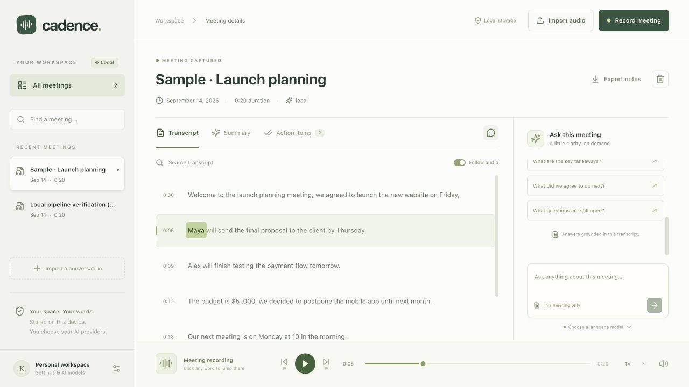

# Cadence · AI Meeting Notes

A local-first desktop meeting recorder: capture microphone + computer audio, upload recordings, replay words in sync with audio, generate meeting notes and action items, and ask questions grounded in the transcript.



## Run on this Mac

Open **Launch Cadence.command** in the project folder, or:

```sh
npm run desktop
```

The launcher starts the project-local Ollama runtime when it is available and no Ollama service is already listening. It builds the UI and opens Electron. For the best macOS system-audio permission behavior, build and open the packaged application:

```sh
npm run package
open release/mac-arm64/Cadence.app
```

The packaged application requires your local Ollama service to be running. API-key providers can be used without Ollama. On first recording, allow the macOS microphone/system-audio prompts. Use the live source meters to confirm both voices are arriving. See [recording setup](docs/recording.md).

## Fresh setup

Requirements: Node.js 22.12+ (24 recommended), Python 3.11–3.13, FFmpeg, and Ollama for local meeting intelligence. macOS 14.2+ is recommended for native system-audio capture; this project targets Apple Silicon by default.

```sh
npm ci
# macOS, when these dependencies are missing:
brew install python@3.12 ffmpeg
npm run setup:local
# Install and start Ollama from https://ollama.com/download
ollama pull qwen3:0.6b
npm run desktop
```

In **Settings → Local setup**, set Python executable to the absolute `.venv/bin/python` path printed by the setup script. The app already has this path configured on the development Mac. Whisper downloads the selected weights on first transcription. Network access is needed for initial model downloads; local processing can then work offline.

Default models:

- **Speech:** open-source faster-whisper `base`, CPU/int8 with real word timestamps.
- **Meeting intelligence:** open-weight Qwen3 `0.6b` through Ollama, chosen for a small initial footprint. For better reasoning and summaries, select and pull `qwen3:4b`, `llama3.2:3b`, or `gemma3:4b` if memory and disk space allow.

The small default LLM can miss nuance. Review summaries, owners, and deadlines against the transcript; citations let you jump to supporting audio.

## Use

1. **Record meeting:** choose microphone, system audio, or both. Start, pause/resume, finish, then save. Headphones reduce echo when using both sources. Recording begins only after you click Start and grant the needed permissions.
2. **Import audio:** choose or drop WAV, MP3, M4A, WebM, OGG, FLAC, AAC, MP4, or AIFF. Original audio is stored locally before processing.
3. **Review transcript:** play/pause, seek, change playback speed, search, and follow highlighted words. Click a word or timestamp to seek. Timing from text-only providers is explicitly labeled estimated.
4. **Review notes:** read the summary and decisions, check off actions, and jump to source evidence where supplied.
5. **Ask this meeting:** questions use transcript evidence and recent chat context; verified segment citations are clickable. For very long calls the assistant uses relevant excerpts and discloses that it has excerpts.
6. **Export:** download meeting notes and transcript as Markdown. The sample button adds an explicitly labeled synthetic meeting for trying the UI without recording anyone.

Recording is live; transcription and notes run after saving. It does not stream a live transcript during the call. Recording bytes remain in memory until saved, so keep the app open. The app asks before discarding an unsaved recording. Once saved, audio persists even when processing fails; retry transcription or summary after fixing the model connection.

## Providers and browser sign-in

Speech options match the OpenClaw batch-audio provider list checked during development: OpenAI, Groq, Deepgram, ElevenLabs, Mistral, Google Gemini, DeepInfra, OpenRouter, SenseAudio, and xAI, plus local Whisper. Provider-specific formats and timestamp capabilities are handled separately.

LLM API adapters and model catalogs come from the installed `@mariozechner/pi-ai` dependency used by OpenClaw. Its installed OAuth registry exposes browser sign-in for **Anthropic, OpenAI Codex, and GitHub Copilot**. Account access, subscriptions, and provider support still apply. Choose a provider in Settings, click Sign in, open its external browser flow, and complete a callback/code prompt if requested. New credentials belong to Cadence; existing OpenClaw credentials are not read or modified.

**LLM browser sign-in does not grant speech API access.** Cloud speech providers require an API key. Custom OpenAI-compatible servers (including LM Studio) accept a model ID and base URL. Infrastructure-specific integrations such as AWS Bedrock, Vertex, and Azure are not exposed as single-key providers.

See [provider support and source references](docs/providers.md) for exact capabilities, timing limitations, and authentication details.

## Local data and privacy

- Meetings, original audio, notes, and chats live in `~/Library/Application Support/Cadence` on macOS. Use `CADENCE_DATA_DIR` for a separate development workspace.
- Desktop credentials use Electron `safeStorage`, backed by the operating system credential store. Browser-only development uses AES-GCM with a permission-restricted local key file; this is not protection against another process running as the same user.
- The renderer receives only configured-key names, never raw stored secrets.
- The server binds to `127.0.0.1`, checks local host/origin, requires an application header for mutations, and sends a restrictive Content Security Policy in the built app.
- Source Git excludes recordings, credentials, model weights, local runtimes, dependencies, and generated application bundles. Only the explicitly generated sample audio is tracked.
- Selecting a cloud STT provider sends audio to it. Selecting a cloud LLM sends transcript evidence and chat prompts to it. Local providers keep inference on this device. Model downloads and OAuth sign-in require network access.
- Audio decoding allows only file/pipe protocols. Cloud recordings are split into five-minute audio chunks. Files are limited to 1 GB and eight hours; large local recordings also require adequate memory.
- A workspace lock prevents running the development server and desktop app against the same data simultaneously. Close one or set a separate `CADENCE_DATA_DIR`.

## Development and verification

```sh
npm run dev          # browser preview 127.0.0.1:4317, API 127.0.0.1:4318
npm run typecheck
npm test             # storage, API workflow, providers, OAuth, recorder, locks
npm run test:local    # real Whisper + Ollama pipeline on the synthetic sample
npm run test:audio    # real Electron Web Audio/MediaRecorder synthetic two-source test
npm run build        # React + desktop main/preload + local server
npm run package      # Apple Silicon .app under release/
```

The synthetic encoder test uses generated tones, not your microphone or actual system audio. It verifies both tones survive mixing and encoding and that no video is saved. Browser-only preview capture depends on browser/OS sharing support; use the desktop app for computer-wide call audio.

Cloud providers are contract-tested with mocked responses. Actual provider billing/account access and OS microphone/system-audio permission grants need verification with your account and device. App signing/notarization for redistribution is not configured; the local build is for development/personal use.

Architecture: React + TypeScript/Vite renderer; isolated Electron main/preload; localhost Express API; atomic local JSON records; Python faster-whisper bridge; Ollama and pi-ai adapters. Background jobs run sequentially to limit local model contention. See [verification notes](docs/verification.md) for the final observed checks.
