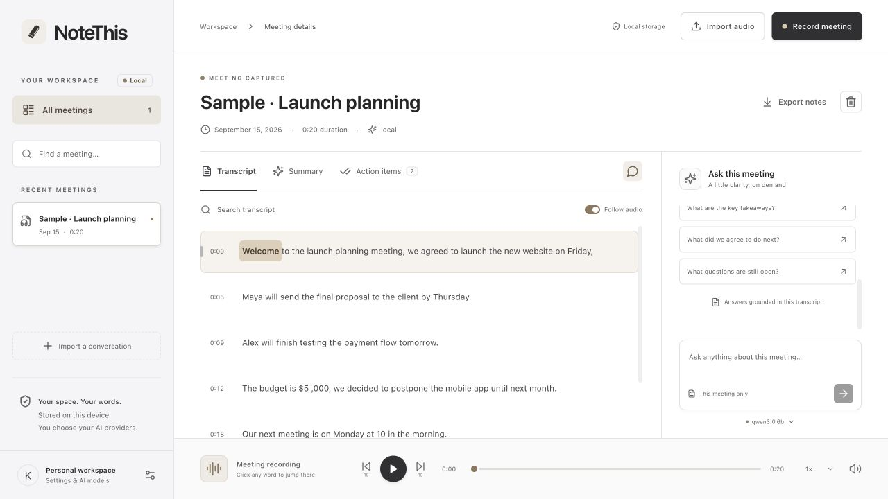

# NoteThis

**Turn a conversation into notes you can use.**

## TLDR

Record a call or upload an audio file. NoteThis turns it into a written transcript, a meeting summary, and a to-do list. Listen back with the words highlighted as they are spoken, or ask questions about what was discussed.

Your recordings and notes are saved on your Mac. Use AI on your computer or connect a supported online service.

## What does it do?

- **Record both sides of a call.** Capture your microphone and the audio playing on your computer, or choose just one.
- **Use recordings you already have.** Upload common audio files, including MP3, M4A, and WAV.
- **Read and listen together.** Follow the highlighted words during playback. Click a word or timestamp to jump to that part of the recording.
- **Get clean, structured notes.** Read formatted summaries with headings, lists, formulas, tables, and simple charts when the meeting supports them. Review decisions and check off action items.
- **Ask your meeting a question.** Try “What did we decide?” or “What do I need to do next?” Jump to the supporting audio from the answer.
- **Add research and diagrams.** Enable web search for questions or useful summary diagrams in Settings when your chosen model supports them. Both start off.
- **Keep a copy.** Export your notes and transcript, download a diagram, or choose **Export LaTeX (.tex)** in the summary for an editable document.

**Transcripts and notes are created after you save the recording**, not live during the call. Keep NoteThis open until your recording is saved. AI can make mistakes, so check important details against the audio.

## How to install

### Installing for the first time

The current version is intended for **Apple Silicon Macs (M1 or newer)**. **macOS 14.2 or newer** is recommended for recording computer audio.

**There isn’t a one-click installer yet.** Downloading the project alone does not install it; the app and its AI tools need a one-time setup.

1. Get access to this project and download a copy to your Mac.
2. Follow the [setup guide](docs/development.md#fresh-setup), or ask someone comfortable with Terminal to help install the required tools and prepare the application.
3. Keep the project folder in place, then open NoteThis using the steps below.

Setup needs internet access. Once the local AI models are downloaded, local transcription and notes can work offline.

### If NoteThis is already set up

1. Open the **AIMeetingNotes** project folder in Finder.
2. Double-click **Launch NoteThis.command**. Open the file itself; don’t paste its name into Terminal. A Terminal window may open as the app starts.
3. If you installed **Ollama** separately, open it first. A project-local copy starts automatically.
4. On your first recording, allow **Microphone** and **Screen & System Audio Recording** access when requested. NoteThis saves audio, not screen video.

If access is blocked, follow the app’s permission message or visit **System Settings → Privacy & Security**, then reopen NoteThis. See [recording help](docs/recording.md).

## Try your first meeting

1. Load the sample meeting to explore without recording, or choose **Record meeting** or **Import audio**.
2. For a call, choose your audio sources, start recording, then stop and save when finished. Headphones help prevent echo.
3. Wait for the transcript and notes. Play the recording, review your actions, or open **Ask this meeting**.

New summaries use LaTeX formatting automatically. To update an older summary, open it and click **Regenerate**. Formulas and data charts do not require an image-generating AI model.

## Choosing AI and keeping your data private

The default setup uses **Whisper** for transcription and **Ollama** for meeting notes and questions. Both run on your computer.

Connect online services in **Settings** using browser sign-in or an **API key** supplied by the service. Charges may apply. A chat subscription does not automatically include speech transcription.

Online services receive the audio or transcript needed for the task. Web search and diagram settings explain what is shared before you enable them. Features depend on your service and account.

For more detail, see [supported services](docs/providers.md), [model and feature settings](docs/model-discovery.md), or the [developer guide](docs/development.md).
